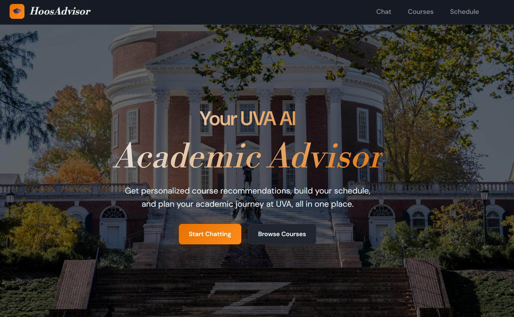

# HoosAdvisor

**Team 17 - CS 4774 Machine Learning - Final Project**

**Team Members:** Amelia Chen, Tyler Qiu, Thomas Kennedy

---

## Overview



A Retrieval-Augmented Generation (RAG) application that consolidates UVA course information from multiple sources into a single, intelligent AI assistant. Students can:

- **Chat with an AI advisor** that has access to real course data, instructor reviews, and prerequisites
- **Browse and search courses** with instant results from cached SIS data
- **Build a schedule** with a visual weekly calendar that the AI can reference when making recommendations

The system combines data from the UVA SIS API, HoosList (course descriptions), TheCourseForum, and RateMyProfessors (instructor reviews), embedding it into a ChromaDB vector database for semantic search. Responses are generated using Google Gemini with full context awareness of the student's current schedule.

### Architecture

```
┌─────────────────────────────────────────────────────────────────┐
│                    Frontend (Jinja2 + FastAPI)                  │
│                HTML/CSS/JS • Markdown Rendering                 │
└─────────────────────────────────────────────────────────────────┘
                                 │
                                 ▼
┌─────────────────────────────────────────────────────────────────┐
│                      FastAPI Backend                            │
│  ┌─────────────┐  ┌─────────────┐  ┌─────────────────────────┐  │
│  │   Routes    │  │    RAG      │  │   Data Sources          │  │
│  │  /chat      │  │   Engine    │  │  • SIS API (courses)    │  │
│  │  /courses   │  │  + Gemini   │  │  • HoosList (prereqs)   │  │
│  │  /schedule  │  │  + ChromaDB │  │  • TCF + RMP (reviews)  │  │
│  └─────────────┘  └─────────────┘  └─────────────────────────┘  │
└─────────────────────────────────────────────────────────────────┘
                                 │
                                 ▼
┌─────────────────────────────────────────────────────────────────┐
│              ChromaDB Vector Database (Embeddings)              │
└─────────────────────────────────────────────────────────────────┘
```

---

## Setup

### 1. Clone and create virtual environment

```bash
git clone https://github.com/your-repo/CS4774-Final-Project.git
cd CS4774-Final-Project

# Create virtual environment
python -m venv venv

# Activate (Windows)
.\venv\Scripts\activate

# Activate (macOS/Linux)
source venv/bin/activate

# Install dependencies
pip install -r requirements.txt

# Install the app package (enables imports)
pip install -e .
```

### 2. Configure environment

```bash
cp env.example .env
```

Edit `.env` and add your Gemini API key:

```env
GEMINI_API_KEY=your-gemini-api-key-here
```

Get a free API key from: https://aistudio.google.com/apikey

---

### 3. Prepare data caches (optional - already included)

The repository includes pre-cached data files for RateMyProfessor and CourseForum reviews. If you need to rebuild them from scratch:

```bash
# Activate virtual environment first, then run from project root:
python src/scripts/build_rmp_cache.py
python src/scripts/build_tcf_reviews_cache.py
```

## Usage

### 1. Start the server

```bash
uvicorn app.main:app --reload
```

### 2. Index course data (first time only)

Visit http://localhost:8000/admin/index and click **"Run Indexing"**

This fetches courses from the SIS API, enriches them with descriptions and reviews from all cached sources, and builds the vector database (~1-2 minutes).

### 3. Use the application

Open http://localhost:8000 in your browser:

| Page | URL | Description |
|------|-----|-------------|
| **Home** | `/` | Landing page with feature overview |
| **Chat** | `/chat` | AI assistant for course questions |
| **Courses** | `/courses` | Search and browse courses |
| **Schedule** | `/schedule` | Build your weekly schedule |

### Example Queries

Try asking the AI assistant:
- "Tell me about CS 4774"
- "Who teaches Machine Learning?"
- "What are the prerequisites for DSA2?"
- "What are the reviews for CS 2130?"
- "What's in my schedule?"

---

## Tech Stack

| Component | Technology |
|-----------|------------|
| Backend | FastAPI (Python) |
| LLM | Google Gemini 2.5 Flash Lite |
| Embeddings | Gemini Embedding API |
| Vector DB | ChromaDB |
| Frontend | Jinja2, HTML/CSS, Vanilla JS |
| Markdown | Mistune |

---

## Data Sources

| Source | Data Provided |
|--------|---------------|
| [UVA SIS API](https://sisuva.admin.virginia.edu) | Course catalog, sections, schedules, instructors |
| [HoosList](https://hooslist.virginia.edu) | Course descriptions, prerequisites |
| [TheCourseForum](https://thecourseforum.com) | Instructor ratings and student reviews |
| [RateMyProfessors](https://ratemyprofessors.com) | Professor ratings, difficulty scores, reviews |

---

## Project Structure

```
CS4774-Final-Project/
├── src/
│   ├── app/
│   │   ├── main.py          # FastAPI entry point
│   │   ├── config.py        # Settings and configuration
│   │   ├── routers/         # API routes (chat, courses, schedule)
│   │   ├── services/        # RAG engine, Gemini service
│   │   ├── data/            # Vector store, data loaders
│   │   └── models/          # Data models
│   ├── scripts/             # Cache building scripts
│   ├── templates/           # Jinja2 HTML templates
│   └── static/              # CSS and images
├── data/                    # ChromaDB + cached API responses
├── tests/                   # Test files
├── pyproject.toml           # Package configuration
├── requirements.txt
└── README.md
```

---

## Video Demo

https://youtu.be/IAYtRCeQ7_s

---

## References

- [FastAPI Documentation](https://fastapi.tiangolo.com/)
- [ChromaDB Documentation](https://docs.trychroma.com/)
- [Google Gemini API](https://ai.google.dev/gemini-api/docs)
- [UVA SIS API Documentation](https://s23.cs3240.org/sis-api.html)

